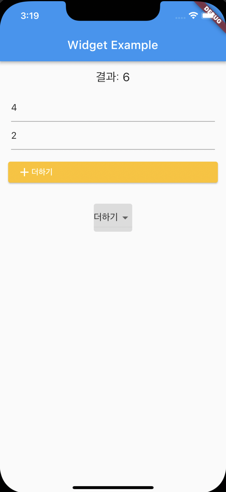
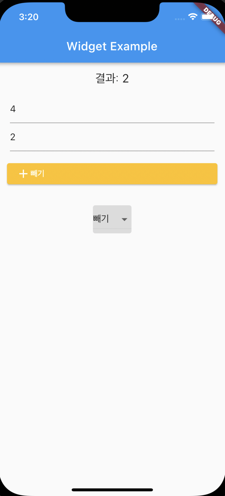
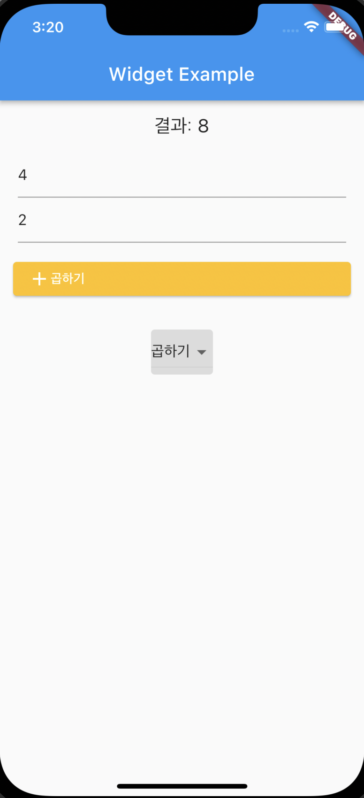
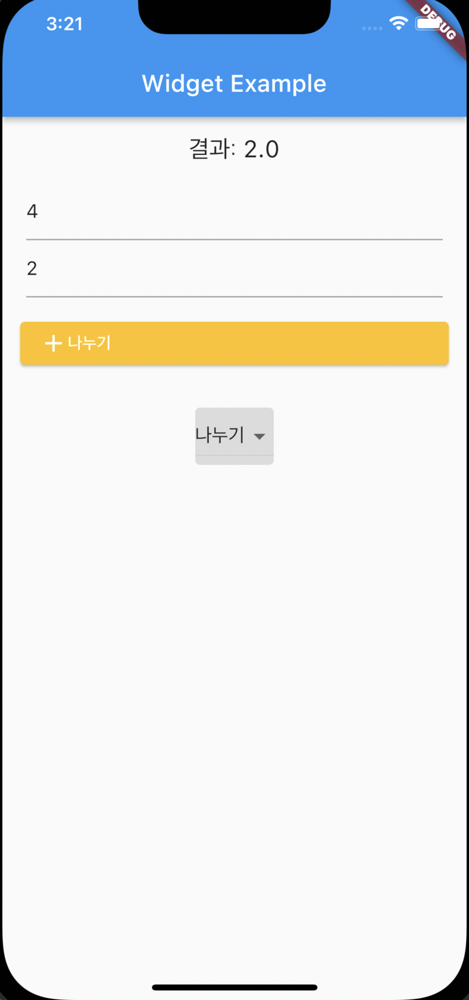

# calculator

    <h3>사용자와 상호작용하는 앱 만들기 ➕ ➖ ✖️ ➗</h3>
     
    
    <h3>덧셈 실행 화면</h3>
     
    
    <h3>뺄셈 실행 화면</h3>
         
    
    <h3>곱셈 실행 화면</h3>
     
    
    <h3>나눗셈 실행 화면</h3>
     

