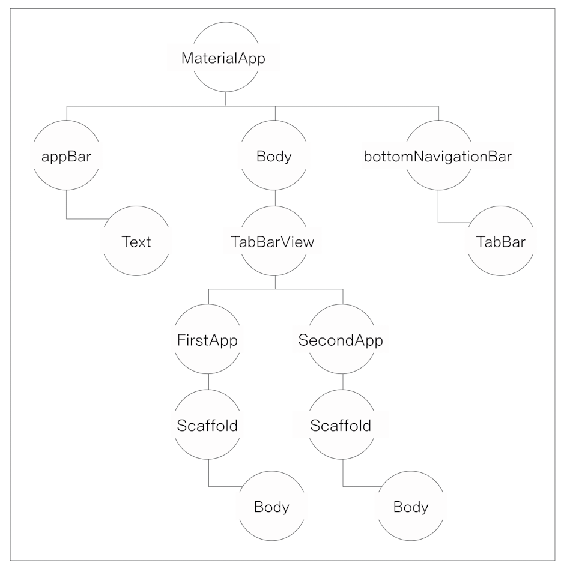
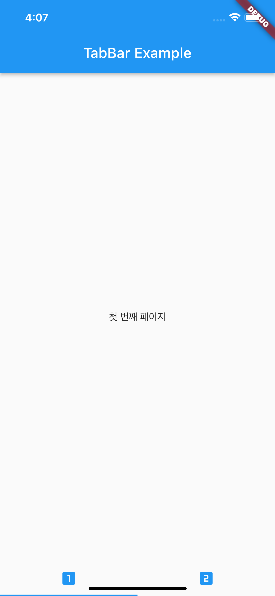
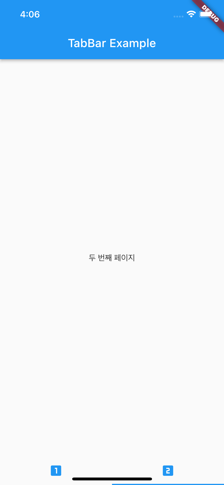
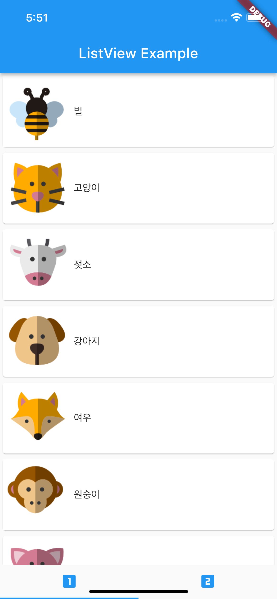
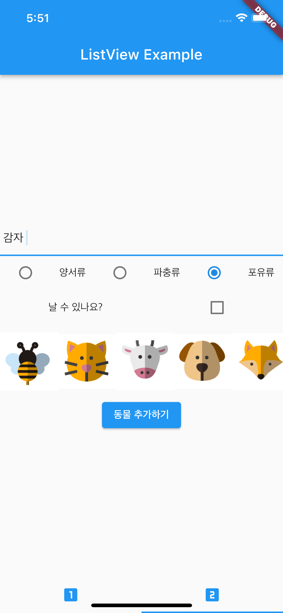

# Chapter 05

<h3>05-1 탭바로 화면 이동하기</h3>
 

    
    <h3>위젯 구성</h3>
     
    
    <h3>첫 번째 화면</h3>
     
    
    <h3>두 번째 화면</h3>
     

 

<h3>05-2 목록을 보여주는 리스트뷰 만들기</h3>
 

    
    <h3>리스트뷰로 구현한 목록</h3>
     
    
    <h3>동물 추가 페이지</h3>

