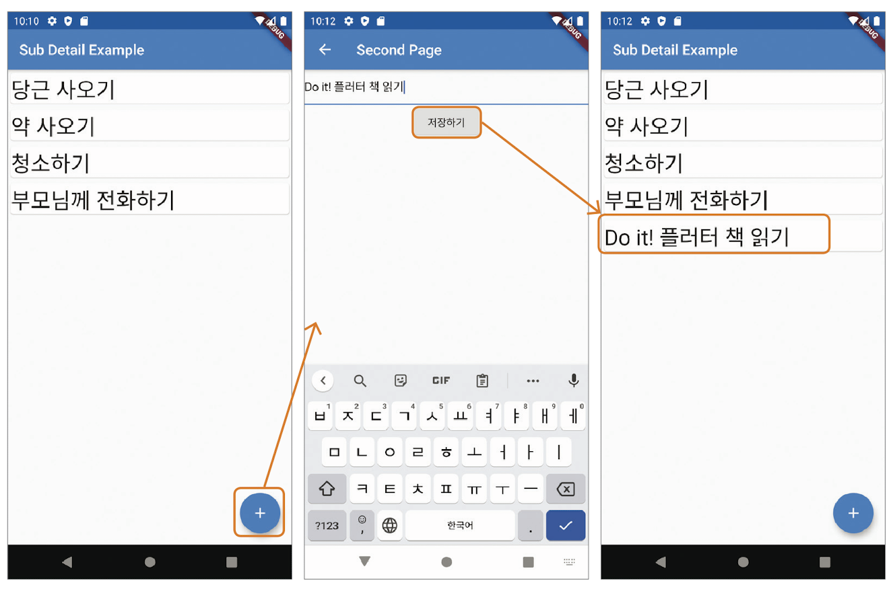

# Chapter 08

<h3>08-1 내비게이션 이해하기 </h3>

**Navigator**
> Navigator는 스택을 이용하여 페이지를 관리하는 클래스입니다. <br/>
> 따라서, 페이지를 표시할 때는 push()를, 제거할 때는 pop()을 사용합니다.


**push()**
```
onPressed() {
    Navigator.of(context)
        .push(MaterialPageRoute(builder: (context) => SecondPage()));
}
```
위 코드와 같이 작성함으로써 onPressed 이벤트가 발생시 스택에 SecondPage가 쌓이며 해당 페이지가 화면에 표시됩니다.
이 때, of(context)는 현재 페이지를 나타내며 MaterialPageRoute()는 머터리얼 스타일로 페이지를 이동하게 해줍니다.
of(context)를 사용하지 않는 경우 `Navigator.push(context, Route);`와 같이 첫 번째 인자에 context를 넣어주어야 합니다.

**pop()**
```
onPressed() {
    Navigator.of(context).pop();   
}
```
위 코드와 같이 작성함으로써 스택 메모리의 최상단에 존재하는 페이지를 제거합니다.
이 때, of(context)는 현재 페이지를 나타내며 이를 사용하지 않는 경우 `Navigator.pop(context);`와 같이 첫 번째 인자에 context를 넣어주어야 합니다.


**Named Route** <br/>
위 예제의 경우 직접적으로 class를 호출하여 스택에 넣어주었는데요, 이는 웹 프로그래밍에서 사용하는 라우팅과 같은 방식으로 사용할 수도 있습니다.

```
void main() => runApp(const MyApp());

class MyApp extends StatelessWidget {
  const MyApp({Key? key}) : super(key: key);

  @override
  Widget build(BuildContext context) {
    return MaterialApp(
      title: 'SubPage Exapmle',
      theme: ThemeData(primarySwatch: Colors.blue),
      initialRoute: '/',
      routes: {
        '/': (context) => const FirstPage(),
        '/second': (context) => const SecondPage()
      },
    );
  }
}    
```
기존에는 MaterialApp()의 인자로 home: FirstPage()와 같이 클래스를 이용하여 직접 홈 페이지를 지정하고 onPressed 핸들러에 내비게이션 코드를 작성하였는데요,
Named Route를 사용하는 경우엔 MaterialApp() 함수의 인자 initialRoute에 초기 경로를, routes에 각 페이지 별 경로를 지정할 수 있습니다.

**pushNamed(route)**
```
onPressed: () {
    Navigator.of(context).pushNamed('/second');
}
```
위의 push()를 사용하는 예제와 똑같이 작동하는 코드입니다. pushNamed()는 push()와 달리 인자에 미리 지정한 라우트를 넣음으로써
해당 라우트에 맞는 페이지를 스택에 쌓고 화면에 표시하도록 합니다.


**pop()**
```
onPressed() {
    Navigator.of(context).pop();   
}
```
pop()은 Named Route든 첫 번째 방식이든 스택 메모리의 최상단에 존재하는 페이지를 제거한다는 점에서 마찬가지이며, 동일한 코드로 작동합니다. 

<br/>

<h3>08-2 할 일을 기록하는 앱 만들기</h3>

<div align="center">
    
    <h3>실행 화면</h3>
</div>